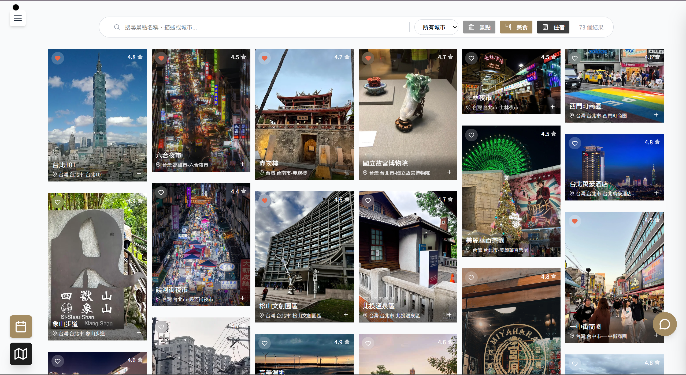
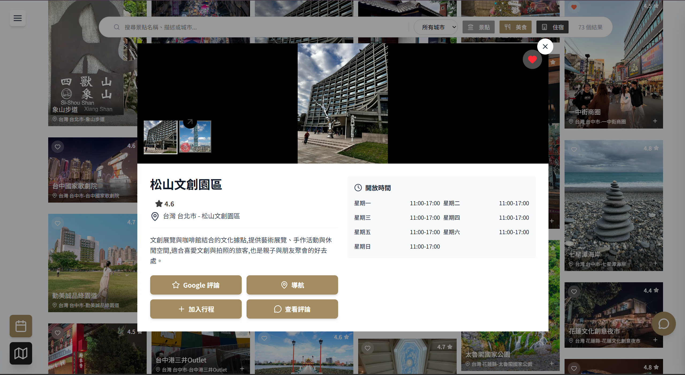
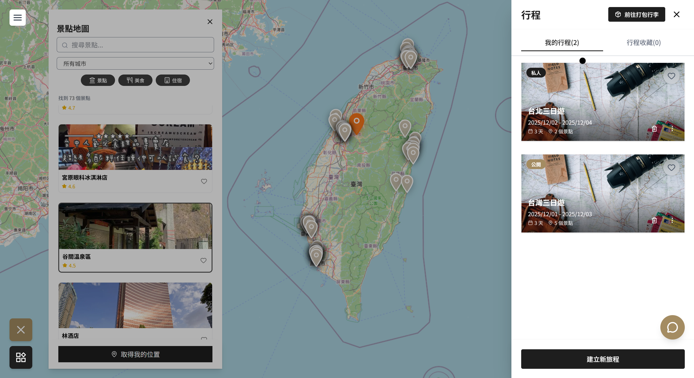

# Sailo — 旅遊行程規劃平台

> 使用 Next.js + React 與 Node.js Backend 打造的整合式旅遊平台


---

## 專案簡介

**Sailo** 是一個整合了景點探索、互動式地圖導航、旅遊行程規劃的完整旅遊平台。  
使用者能在平台內完成所有旅遊需求，從瀏覽景點、建立多天行程，到與他人分享旅遊計畫。

> 本專案為資展國際前端工程師就業養成班（588 小時）期末團體專題。  
> 本人負責 **景點搜尋篩選模組**、**Leaflet.js 地圖導航模組**、**行程管理系統**、**RESTful API 串接**。

---

## 截圖

| 景點列表 & 篩選搜尋 | 景點詳情卡片 |
|:---:|:---:|
|  |  |

| 地圖導航 & 行程管理 |
|:---:|
|  |

---

## 主要功能

### 景點探索（我負責）
- 依地區、類別篩選景點（景點 / 美食 / 住宿）
- 關鍵字即時搜尋，前端防抖處理，流暢反應使用者輸入
- 景點卡片瀑布流布局，共顯示 73 筆資料
- 點擊景點查看完整資訊、圖片輪播、評論入口

### 互動式地圖 & 導航（我負責）
- 使用 **Leaflet.js** 整合 GeoJSON 呈現全台景點 Marker
- 點擊景點卡片 → 地圖 Marker 自動高亮並彈出 Popup
- 所有景點儲存精準經緯度，確保搜尋準確度
- 一鍵串接 **Google Maps** 即時導航
- 串接 **Google Reviews** 跳轉評論頁面

### 行程管理系統（我負責）
- 建立行程，支援公開 / 私人切換
- 多天行程規劃，每天可加入任意景點
- 為行程中的景點撰寫個人備註
- 行程卡片操作：編輯、收藏、複製、刪除

### 社群與收藏
- 公開行程瀏覽，一鍵複製他人行程到自己帳號
- 收藏景點與行程清單管理
- 使用者評論與評分系統（完整 CRUD）

### 圖片上傳
- 使用者可上傳到訪照片
- 透過 **ImageKit** 雲端儲存與 CDN 快取，提升載入速度

### 其他功能
- 即時客服聊天室（Socket.io）
- AI 聊天助手（Ollama）
- 商品購物車與結帳（綠界金流）
- 旅遊部落格（文章、留言、追蹤）
- 打包清單（含天氣卡）

---

## 技術架構

### Frontend（本 Repo）
| 技術 | 用途 |
|------|------|
| Next.js 14 (App Router) | 前端框架與路由 |
| React 18 | UI 元件 |
| Tailwind CSS | 樣式 |
| Axios | API 串接 |
| Leaflet.js | 互動式地圖 |
| ImageKit | 雲端圖片儲存 |
| Socket.io-client | 即時聊天 |

### Backend（[sailo_backend](https://github.com/bton9/sailo_backend) ｜ DB Schema：[sailo_db](https://github.com/bton9/sailo_db)）
| 技術 | 用途 |
|------|------|
| Node.js + Express | 後端框架 |
| MySQL | 資料庫 |
| RESTful API | API 設計規範 |
| JWT + Google OAuth | 身份驗證 |
| Socket.io | 即時通訊 |
| ImageKit | 圖片儲存服務 |
| Ollama | AI 聊天模型 |

---

## 專案結構

```
sailo_fronte_end/
├── app/                      # Next.js App Router 頁面
│   ├── site/
│   │   ├── custom/           # 景點探索、地圖、行程（本人負責）
│   │   │   ├── components/
│   │   │   │   ├── location/ # 景點卡片、詳情、圖片
│   │   │   │   ├── map/      # Leaflet 地圖、Sidebar、篩選
│   │   │   │   └── addtotrip/# 加入行程、收藏清單
│   │   │   └── hook/         # useFilter、usePlaces、useAddToTrip
│   │   ├── blog/             # 旅遊部落格
│   │   ├── cart/             # 購物車與結帳
│   │   ├── product/          # 商品頁
│   │   ├── map/              # 獨立地圖頁
│   │   └── membercenter/     # 會員中心
│   ├── auth/                 # 登入 / 重設密碼
│   └── admin/                # 後台管理
├── components/               # 共用元件
│   ├── auth/                 # 登入、註冊、OTP
│   ├── chatroom/             # 客服聊天室
│   └── navbar.jsx、footer.jsx 等
├── contexts/                 # 全域狀態（Auth、Cart、Wishlist）
├── services/                 # API 呼叫封裝
├── hook/                     # 全域 Custom Hooks
├── lib/                      # 工具函式
├── styles/                   # 全域 CSS
└── public/                   # 靜態資源、影片背景
```

---

## 安裝與使用

### 環境需求
- Node.js v18+
- MySQL（建議使用 MySQL Workbench）
- npm

### 安裝步驟

```bash
# 1. Clone 前端專案
git clone https://github.com/bton9/sailo_fronte_end.git
cd sailo

# 2. 安裝相依套件（需要一點時間）
npm i

# 3. 設定環境變數
cp .env.example .env
# 填入對應的 API 設定（見下方說明）

# 4. 啟動開發伺服器
npm run dev
```

按住 `Ctrl` 點擊終端機中的 `http://localhost:3000` 開啟專案。

> 需同時啟動後端服務，請參考 [sailo_backend](https://github.com/bton9/sailo_backend)

### 測試帳號
```
帳號：sailo@sailo.com
密碼：123456
```

---

## ⚙️ 環境變數

請在專案根目錄建立 `.env` 檔案：

```env
NEXT_PUBLIC_API_URL=http://localhost:5000
NEXT_PUBLIC_IMAGEKIT_PUBLIC_KEY=
NEXT_PUBLIC_IMAGEKIT_URL_ENDPOINT=
```

> 如需完整設定，請聯繫作者。

---

## 作者

**林新堯**  
資展國際前端工程師就業養成班（2025/6 – 2025/11）  
GitHub：[@bton9](https://github.com/bton9)